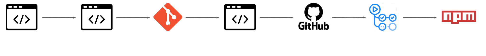

<h1 align="center">Bem-vindo ao Panamah SDK 👋</h1>

<p>
  <a href="https://www.npmjs.com/package/panamah-sdk" target="_blank">
    
  </a>
  <a href="https://github.com/quickdata-team/panamah-sdk-nodejs-v2/blob/main/LICENSE" target="_blank">
    
  </a>
  <a href="https://docs-sdk.panamah.io" target="_blank">
    
  </a>
  
</p>

> SDK do Panamah em NodeJs

## 📑 Sobre

O PanamahSDK facilita o consumo dos serviços do Panamah, permitindo a manipulação e validação de dados, leitura de documentos fiscais e gerenciamento de assinantes de forma prática e segura.

## 💻 Pré-requisitos

Antes de começar, verifique se você atendeu aos seguintes requisitos:

- Você instalou o `nodejs` na versão `>=12`
- Você possui o `npm` na versão `>=6`

## 🚀 Getting Started

Faça o download deste reposítório conforme o exemplo a seguir:

```sh
git clone git@github.com:quickdata-team/panamah-sdk-nodejs-v2.git
```

Certifique-se que a sua máquina atende os [pré-requisitos](#💻-pré-requisitos) estabelecidos e execute um dos comandos abaixo:

### Npm

```sh
npm install
```

### Yarn

```sh
yarn install
```

Pronto 🥳, 
<br>agora você tem um ambiente de desenvolvimento configurado para o  Panamah SDK
## 🧪 Testes

```sh
npm run test
```

```sh
npm run test:coverage
```

## 🛠️ Linter

```sh
npm run lint:fix
```

```sh
npm run style:fix
```

## 🏷️ Versionamento

### Git Flow


### Conventional Commits

```sh
<type>[optional scope]: <description>
```

### Update Release

```sh
npm run release
```

## ☁️ Deploy

Para realizar o deploy do SDK é necessário a execução dos seguintes passos: 

